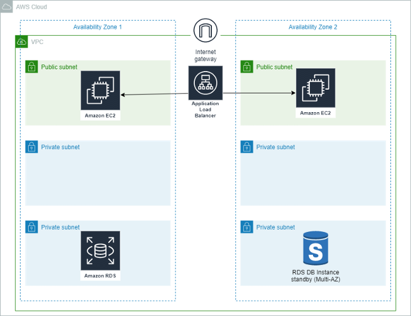

> [CloudNet@] 테라폼 기초 입문 스터디 정리
> 참고 : Terraform Up & Running 2nd Edition

# 3tier architecture in AWS

## Terraform?

Terraform은 프로덕션 준비 환경을 생성, 관리 및 배포할 수 있는 코드형 오픈 소스 인프라(IAC) 도구입니다. Terraform은 클라우드 API를 선언적 구성 파일로 코드화합니다. Terraform은 기존 서비스 공급자와 맞춤형 사내 솔루션을 모두 관리할 수 있습니다.

이 프로젝트에서는 에서는 Terraform을 사용하여 AWS에 3계층 애플리케이션을 배포합니다.


 

# 사전 준비:

- **AWS** & **Terraform**에 대한 기본 지식
- AWS 계정
- **AWS Access** & **Secret Key**


*In this project, I have used some variables also that I will discuss later in this article.*


**Step 1:-** **VPC** 생성

- `vpc.tf` 

```
# Creating VPC
resource "aws_vpc" "demovpc" {
  cidr_block       = "${var.vpc_cidr}"
  instance_tenancy = "default"tags = {
    Name = "Demo VPC"
  }
}
```


**Step 2:-** **Subnet** 생성

- 이 프로젝트에서는 퍼블릭 및 프라이빗 서브넷이 혼합된 프런트 엔드 계층 및 백엔드 계층에 대해 총 6개의 서브넷을 생성합니다.
- `subnet.tf` 

```
# Creating 1st web subnet 
resource "aws_subnet" "public-subnet-1" {
  vpc_id                  = "${aws_vpc.demovpc.id}"
  cidr_block             = "${var.subnet_cidr}"
  map_public_ip_on_launch = true
  availability_zone = "us-east-1a"
tags = {
    Name = "Web Subnet 1"
  }
}
# Creating 2nd web subnet 
resource "aws_subnet" "public-subnet-2" {
  vpc_id                  = "${aws_vpc.demovpc.id}"
  cidr_block             = "${var.subnet1_cidr}"
  map_public_ip_on_launch = true
  availability_zone = "us-east-1b"
tags = {
    Name = "Web Subnet 2"
  }
}
# Creating 1st application subnet 
resource "aws_subnet" "application-subnet-1" {
  vpc_id                  = "${aws_vpc.demovpc.id}"
  cidr_block             = "${var.subnet2_cidr}"
  map_public_ip_on_launch = false
  availability_zone = "us-east-1a"
tags = {
    Name = "Application Subnet 1"
  }
}
# Creating 2nd application subnet 
resource "aws_subnet" "application-subnet-2" {
  vpc_id                  = "${aws_vpc.demovpc.id}"
  cidr_block             = "${var.subnet3_cidr}"
  map_public_ip_on_launch = false
  availability_zone = "us-east-1b"
tags = {
    Name = "Application Subnet 2"
  }
}
# Create Database Private Subnet
resource "aws_subnet" "database-subnet-1" {
  vpc_id            = "${aws_vpc.demovpc.id}"
  cidr_block        = "${var.subnet4_cidr}"
  availability_zone = "us-east-1a"
tags = {
    Name = "Database Subnet 1"
  }
}
# Create Database Private Subnet
resource "aws_subnet" "database-subnet-2" {
  vpc_id            = "${aws_vpc.demovpc.id}"
  cidr_block        = "${var.subnet5_cidr}"
  availability_zone = "us-east-1a"
tags = {
    Name = "Database Subnet 1"
  }
}
```


**Step 3:-** **Internet Gateway** 생성

- `igw.tf` 

```
# Creating Internet Gateway 
resource "aws_internet_gateway" "demogateway" {
  vpc_id = "${aws_vpc.demovpc.id}"
}
```


**Step 4:-**  **Route table**

- `route_table_public.tf`
- 다음 코드에서 새 route table을 만들고 모든 요청을 0.0.0.0/0 CIDR 블록으로 전달합니다.
- 또한 이 route table을 이전에 만든 서브넷에 연결합니다. 따라서 퍼블릭 서브넷으로 작동합니다.

```
# Creating Route Table
resource "aws_route_table" "route" {
    vpc_id = "${aws_vpc.demovpc.id}"
route {
        cidr_block = "0.0.0.0/0"
        gateway_id = "${aws_internet_gateway.demogateway.id}"
    }
tags = {
        Name = "Route to internet"
    }
}
# Associating Route Table
resource "aws_route_table_association" "rt1" {
    subnet_id = "${aws_subnet.demosubnet.id}"
    route_table_id = "${aws_route_table.route.id}"
}
# Associating Route Table
resource "aws_route_table_association" "rt2" {
    subnet_id = "${aws_subnet.demosubnet1.id}"
    route_table_id = "${aws_route_table.route.id}"
}
```


**Step 5:-** **EC2 instances** 생성

- `ec2.tf`
- 다음 코드에서는 userdata를 사용하여 EC2 인스턴스를 구성했습니다. 
-  data.sh 에 대해서는 나주에 설명하겠습니다.

```
# Creating 1st EC2 instance in Public Subnet
resource "aws_instance" "demoinstance" {
  ami                         = "ami-087c17d1fe0178315"
  instance_type               = "t2.micro"
  count                       = 1
  key_name                    = "tests"
  vpc_security_group_ids      = ["${aws_security_group.demosg.id}"]
  subnet_id                   = "${aws_subnet.demoinstance.id}"
  associate_public_ip_address = true
  user_data                   = "${file("data.sh")}"
tags = {
    Name = "My Public Instance"
  }
}
# Creating 2nd EC2 instance in Public Subnet
resource "aws_instance" "demoinstance1" {
  ami                         = "ami-087c17d1fe0178315"
  instance_type               = "t2.micro"
  count                       = 1
  key_name                    = "tests"
  vpc_security_group_ids      = ["${aws_security_group.demosg.id}"]
  subnet_id                   = "${aws_subnet.demoinstance.id}"
  associate_public_ip_address = true
  user_data                   = "${file("data.sh")}"
tags = {
    Name = "My Public Instance 2"
  }
}
```


**Step 6:-** **FrontEnd** **tier**을 위한 **Security Group** 생성

- `web_sg.tf` 
- 인바운드 연결을 위해 80,443 및 22개 포트를 열었고 아웃바운드 연결을 위해 모든 포트를 열었습니다.

```
# Creating Security Group 
resource "aws_security_group" "demosg" {
  vpc_id = "${aws_vpc.demovpc.id}"
# Inbound Rules
  # HTTP access from anywhere
  ingress {
    from_port   = 80
    to_port     = 80
    protocol    = "tcp"
    cidr_blocks = ["0.0.0.0/0"]
  }
# HTTPS access from anywhere
  ingress {
    from_port   = 443
    to_port     = 443
    protocol    = "tcp"
    cidr_blocks = ["0.0.0.0/0"]
  }
# SSH access from anywhere
  ingress {
    from_port   = 22
    to_port     = 22
    protocol    = "tcp"
    cidr_blocks = ["0.0.0.0/0"]
  }
# Outbound Rules
  # Internet access to anywhere
  egress {
    from_port   = 0
    to_port     = 0
    protocol    = "-1"
    cidr_blocks = ["0.0.0.0/0"]
  }
tags = {
    Name = "Web SG"
  }
}
```


**Step 7:-** **Database** **tier**을 위한  **Security Group** 생성

-  `database_sg.tf` 
- 인바운드 연결을 위해 3306 포트를 열었고 아웃바운드 연결을 위해 모든 포트를 열었습니다.

```
# Create Database Security Group
resource "aws_security_group" "database-sg" {
  name        = "Database SG"
  description = "Allow inbound traffic from application layer"
  vpc_id      = aws_vpc.demovpc.id
ingress {
    description     = "Allow traffic from application layer"
    from_port       = 3306
    to_port         = 3306
    protocol        = "tcp"
    security_groups = [aws_security_group.demosg.id]
  }
egress {
    from_port   = 32768
    to_port     = 65535
    protocol    = "tcp"
    cidr_blocks = ["0.0.0.0/0"]
  }
tags = {
    Name = "Database SG"
  }
```


**Step 8:-** **Application Load Balancer** 생성

-  `alb.tf` 
- external Load balancer type으로 생
- 로드 밸런서 유형은 ALB
- aws_lb_target_group_attachment 리소스는 인스턴스를 대상 그룹에 연결합니다.
- 80 포트에서 요청 요청 수신

```
# Creating External LoadBalancer
resource "aws_lb" "external-alb" {
  name               = "External LB"
  internal           = false
  load_balancer_type = "application"
  security_groups    = [aws_security_group.demosg.id]
  subnets            = [aws_subnet.public-subnet-1.id, aws_subnet.public-subnet-1.id]
}
resource "aws_lb_target_group" "target-elb" {
  name     = "ALB TG"
  port     = 80
  protocol = "HTTP"
  vpc_id   = aws_vpc.demovpc.id
}
resource "aws_lb_target_group_attachment" "attachment" {
  target_group_arn = aws_lb_target_group.external-alb.arn
  target_id        = aws_instance.demoinstance.id
  port             = 80
depends_on = [
    aws_instance.demoinstance,
  ]
}
resource "aws_lb_target_group_attachment" "attachment" {
  target_group_arn = aws_lb_target_group.external-alb.arn
  target_id        = aws_instance.demoinstance1.id
  port             = 80
depends_on = [
    aws_instance.demoinstance1,
  ]
}
resource "aws_lb_listener" "external-elb" {
  load_balancer_arn = aws_lb.external-alb.arn
  port              = "80"
  protocol          = "HTTP"
default_action {
    type             = "forward"
    target_group_arn = aws_lb_target_group.external-alb.arn
  }
}
```


**Step 9:-** **RDS instance** 생성

- `rds.tf` 
- 다음 코드에서 username 및 password을 변경해야 합니다.
- multi-az는 고가용성을 위해 true로 설정됩니다.

```
# Creating RDS Instance
resource "aws_db_subnet_group" "default" {
  name       = "main"
  subnet_ids = [aws_subnet.database-subnet-1.id, aws_subnet.database-subnet-1.id]
tags = {
    Name = "My DB subnet group"
  }
}
resource "aws_db_instance" "default" {
  allocated_storage      = 10
  db_subnet_group_name   = aws_db_subnet_group.default.id
  engine                 = "mysql"
  engine_version         = "8.0.20"
  instance_class         = "db.t2.micro"
  multi_az               = true
  name                   = "mydb"
  username               = "username"
  password               = "password"
  skip_final_snapshot    = true
  vpc_security_group_ids = [aws_security_group.database-sg.id]
}
```


**Step 10:-** **outputs**

- `outputs.tf` 
- ALB의 DNS를 가져옵니다.

```
# Getting the DNS of load balancer
output "lb_dns_name" {
  description = "The DNS name of the load balancer"
  value       = "${aws_lb.external-alb.dns_name}"
}
```


**Step 11:-** **variable**

- `vars.tf` 

```
# Defining CIDR Block for VPC
variable "vpc_cidr" {
  default = "10.0.0.0/16"
}
# Defining CIDR Block for 1st Subnet
variable "subnet_cidr" {
  default = "10.0.1.0/24"
}
# Defining CIDR Block for 2nd Subnet
variable "subnet1_cidr" {
  default = "10.0.2.0/24"
}
# Defining CIDR Block for 3rd Subnet
variable "subnet2_cidr" {
  default = "10.0.3.0/24"
}
# Defining CIDR Block for 3rd Subnet
variable "subnet2_cidr" {
  default = "10.0.4.0/24"
}
# Defining CIDR Block for 3rd Subnet
variable "subnet2_cidr" {
  default = "10.0.5.0/24"
}
# Defining CIDR Block for 3rd Subnet
variable "subnet2_cidr" {
  default = "10.0.6.0/24"
}
```


**Step 12:-**  **user data**

- `data.sh` 
- 다음 코드는 EC2 인스턴스에 Apache 웹 서버를 설치합니다.

```
#!/bin/bash
yum update -y
yum install -y httpd.x86_64
systemctl start httpd.service
systemctl enable httpd.service
echo "Hello World from $(hostname -f)" > /var/www/html/index.html
```


**Step 12:-**  infrastructure 생성

* 다음 명령을 이용하여 인프라 생성

  * terraform init은 작업 디렉토리를 초기화하고 공급자의 플러그인을 다운로드하는 것입니다.

  * terraform 계획은 코드에 대한 실행 계획을 만드는 것입니다.

  * terraform 적용은 실제 인프라를 생성하는 것입니다. 
    인프라를 생성하기 위해 액세스 키와 비밀 키를 제공하라는 메시지가 표시됩니다. 
    따라서 Access Key와 Secret Key를 하드코딩하는 것보다 런타임에 적용하는 것이 좋습니다.


**Step 13:-** 생성된 리소스 확인

* 테라폼은 다음 리소스를 생성합니다
  1. **VPC**
  2. **Application Load Balancer**
  3. **Public & Private Subnets**
  4. **EC2 Instances**
  5. **Route Table**
  6. **Internet Gateway**
  7. **RDS Instance**
  8. **Security Groups for Web & RDS instances**


리소스 생성이 완료되면 로드 밸런서의 DNS를 가져와서 브라우저에 붙여 넣으면 로드 밸런서가 두 인스턴스에 요청을 보내는 것을 볼 수 있습니다.

이상으로 Terraform을 사용하여 AWS에서 다양한 리소스를 생성하는 방법을 실습하였습니다.
